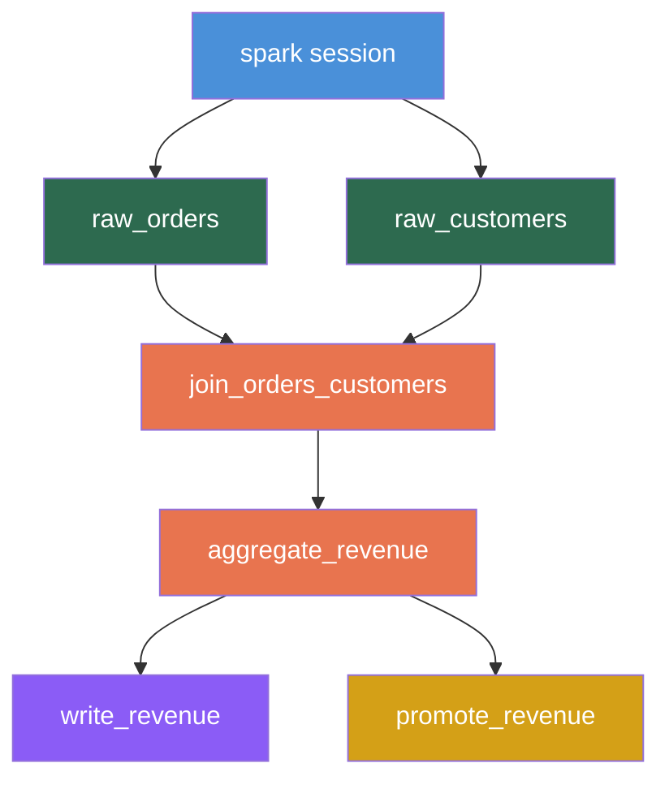
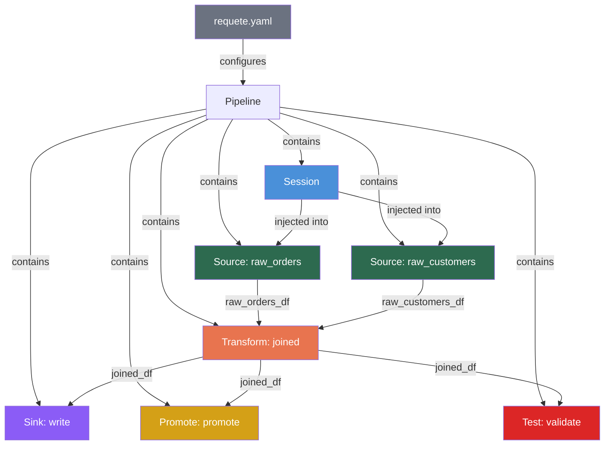

# Core Concepts

This page explains the foundational concepts in Requete: pipelines, nodes, the DAG, sessions, environments, dependency injection, testing, and code generation.

## Pipelines

A pipeline is a named collection of nodes that together define a data workflow. Each pipeline lives in its own directory and is configured via a `requete.yaml` file.

```yaml
pipeline: order_processing
python_version: "3.11"
dependencies:
  - pyspark
  - duckdb
  - requests
```

| Field | Description |
|-------|-------------|
| `pipeline` | A unique name for the pipeline. Used to identify it in the CLI, API, and IDE. |
| `python_version` | The Python version to use. Requete uses uv to provision this automatically. |
| `dependencies` | Python packages required by your pipeline code. Installed automatically by uv. |

A typical project contains multiple pipelines, each in its own subdirectory:

```
requete_pipelines/
├── order_processing/
│   ├── requete.yaml
│   ├── sessions/
│   ├── sources/
│   ├── transforms/
│   └── sinks/
├── user_analytics/
│   ├── requete.yaml
│   └── ...
└── data_quality/
    ├── requete.yaml
    └── ...
```

## Nodes

Nodes are the building blocks of a pipeline. Each node is a Python function decorated with one of the Requete decorators. Every node has a **tag** (a unique identifier) and a **depends_on** list (its upstream dependencies).

### Node Types

| Type | Decorator | Purpose | Dependencies |
|------|-----------|---------|-------------|
| **Source** | `@nodes.source` | Reads or generates data. Entry point of the DAG. | `depends_on=[]` (no upstream nodes) |
| **Backfill Source** | `@nodes.backfill_source` | Reads data for backfill runs. Active only in backfill environment. | `depends_on=[]` |
| **Transform** | `@nodes.transform` | Transforms one or more upstream DataFrames. | One or more upstream tags |
| **Sink** | `@nodes.sink` | Writes data to a destination. Terminal node. | One or more upstream tags |
| **Promote** | `@nodes.promote` | Promotes data between environments (e.g., staging to production). | One or more upstream tags |

```python
from requete import nodes

@nodes.source(tag="raw_events", depends_on=[])
def read_events(sparkSession):
    return sparkSession.read.table("bronze.events")

@nodes.transform(tag="parsed_events", depends_on=["raw_events"])
def parse_events(raw_events_df):
    return raw_events_df.selectExpr(
        "event_id",
        "from_json(payload, 'struct<action:string,ts:timestamp>') as parsed"
    ).select("event_id", "parsed.*")

@nodes.sink(tag="write_events", depends_on=["parsed_events"])
def write_events(parsed_events_df):
    parsed_events_df.write.mode("append").saveAsTable("silver.events")

@nodes.promote(tag="promote_events", depends_on=["parsed_events"])
def promote_events(parsed_events_df):
    parsed_events_df.write.mode("overwrite").saveAsTable("gold.events")
```

## DAG

Nodes are assembled into a directed acyclic graph (DAG) based on their `depends_on` declarations. The Rust core parses all Python files in a pipeline directory, extracts the decorator metadata, and builds the graph.



The DAG is validated at parse time. Requete catches the following errors before any code runs:

- **Cycles**: A node cannot depend on itself or create a circular dependency chain.
- **Missing dependencies**: If a node declares `depends_on=["foo"]` but no node with `tag="foo"` exists, the build fails.
- **Type constraints**: Sources cannot have upstream dependencies. Sinks and promotes must have at least one.

## Sessions

Sessions define how Requete connects to a compute engine. Each session specifies an engine type and the environments in which it is active.

```python
from requete import sessions
from pyspark.sql import SparkSession


@sessions.session(engine="spark", env=["dev", "ci"])
def local_spark():
    return (
        SparkSession.builder
        .master("local[*]")
        .appName("my_pipeline")
        .getOrCreate()
    )


@sessions.session(engine="spark", env=["staging", "prod"])
def cluster_spark():
    return (
        SparkSession.builder
        .master("yarn")
        .appName("my_pipeline")
        .config("spark.executor.instances", "10")
        .getOrCreate()
    )
```

Supported engines:

| Engine | Session returns | Use case |
|--------|----------------|----------|
| `spark` | `SparkSession` | Large-scale distributed processing |
| `duckdb` | `duckdb.Connection` | Local analytics and development |
| `snowflake` | Snowflake session | Cloud data warehouse operations |

A pipeline can have multiple sessions for different engines and environments. Requete selects the correct session at runtime based on the target environment.

## Environments

Environments control which nodes and sessions are active during a run. Requete supports five environments:

| Environment | Typical use |
|-------------|-------------|
| `dev` | Local development and iteration |
| `ci` | Automated testing in CI/CD pipelines |
| `staging` | Pre-production validation |
| `prod` | Production execution |
| `backfill` | Historical data reprocessing |

Nodes and sessions declare their environments via the `env` parameter:

```python
# This source runs in all environments (empty env list = everywhere)
@nodes.source(tag="orders", depends_on=[])
def read_orders(sparkSession):
    return sparkSession.read.table("bronze.orders")

# This source only runs in dev — reads from a local file instead
@nodes.source(tag="orders", depends_on=[], env=["dev"])
def read_orders_dev(sparkSession):
    return sparkSession.read.csv("/data/sample_orders.csv", header=True)

# This backfill source only runs in the backfill environment
@nodes.backfill_source(tag="orders", depends_on=[], env=["backfill"])
def read_orders_backfill(sparkSession):
    return sparkSession.read.table("archive.orders_2023")
```

The same tag can have different implementations for different environments. Requete resolves which implementation to use based on the target environment at runtime.

## Dependency Injection

Requete uses a convention-based dependency injection system. You do not import or call upstream nodes directly. Instead, Requete injects their output DataFrames as function parameters.

### DataFrame injection

Upstream DataFrames are injected using the naming convention `<tag>_df`:

```python
@nodes.transform(tag="enriched", depends_on=["users", "orders"])
def enrich(users_df, orders_df):
    return users_df.join(orders_df, "user_id", "inner")
```

The `users_df` parameter receives the DataFrame from the node with `tag="users"`. The `orders_df` parameter receives the DataFrame from the node with `tag="orders"`. Requete matches parameter names to tags automatically.

### Session injection

Source nodes receive the compute engine session as a parameter named after the session type:

```python
@nodes.source(tag="events", depends_on=[])
def read_events(sparkSession):
    return sparkSession.read.table("bronze.events")
```

The `sparkSession` parameter is injected with the active Spark session for the current environment.

## Tests

Requete provides four built-in test types, all defined with decorators:

### Unit Tests

Test individual node logic in isolation with mock data:

```python
from requete import tests
from pyspark.sql import SparkSession


@tests.unit(node_tag="active_users")
def test_filters_inactive(sparkSession: SparkSession):
    input_df = sparkSession.createDataFrame(
        [(1, True), (2, False), (3, True)],
        ["id", "is_active"]
    )
    # The function under test is called automatically with this input
    result = input_df.filter("is_active = true")
    assert result.count() == 2
```

### Integration Tests

Test a subgraph or full pipeline end-to-end:

```python
@tests.integration(node_tags=["users", "active_users", "write_active_users"])
def test_full_pipeline(sparkSession: SparkSession):
    # Requete runs the specified nodes in order
    # Assertions run after execution completes
    result = sparkSession.read.table("gold.active_users")
    assert result.count() > 0
```

### Source Validation Tests

Validate data quality at the source level:

```python
@tests.source(node_tag="raw_orders")
def test_orders_schema(raw_orders_df):
    expected_columns = {"order_id", "customer_id", "amount", "status"}
    actual_columns = set(raw_orders_df.columns)
    assert expected_columns.issubset(actual_columns), f"Missing columns: {expected_columns - actual_columns}"
```

### Promotion Tests

Gate checks that must pass before data is promoted to production:

```python
@tests.promotion(node_tag="promote_events")
def test_no_nulls_in_key_columns(promote_events_df):
    null_count = promote_events_df.filter("event_id IS NULL").count()
    assert null_count == 0, f"Found {null_count} null event_ids"
```

## Code Generation

Requete does not execute your decorated functions directly. Instead, the Rust core generates Python scripts that:

1. Import your function from its module.
2. Retrieve upstream DataFrames from the engine's result store.
3. Call your function with the injected parameters.
4. Store the returned DataFrame for downstream nodes.

This approach provides several benefits:

- **Isolation**: Each node runs in a controlled context. Import errors or side effects in one node do not affect others.
- **Reproducibility**: Generated scripts capture the exact execution plan, including dependency order and parameter bindings.
- **Engine independence**: The code generation layer handles differences between Spark, DuckDB, and Snowflake session management.
- **Validation before execution**: The entire DAG is parsed, validated, and the execution plan is generated before any Python code runs. Errors in dependency declarations, missing tags, or cycle detection happen at build time, not at runtime.

The generated scripts are sent to the Python engine via gRPC for execution. You can inspect the generated scripts for debugging, but you never need to write or modify them.

## Putting It All Together

Here is how these concepts connect in a complete pipeline:



1. The `requete.yaml` defines the pipeline, its Python version, and its dependencies.
2. Sessions connect to compute engines, scoped to specific environments.
3. Sources read data and produce DataFrames.
4. Transforms consume upstream DataFrames (injected by tag name) and produce new DataFrames.
5. Sinks write DataFrames to their final destinations.
6. Promotes move data between environments with gating tests.
7. Tests validate data quality and correctness at every stage.
8. The Rust core parses everything, builds the DAG, generates scripts, and sends them to the Python engine for execution.
