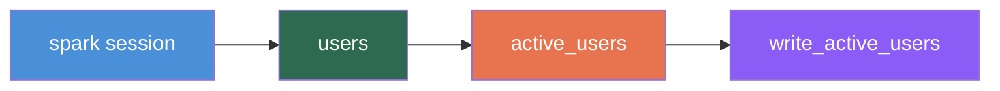

# Quickstart

In this tutorial, you will build a complete data pipeline with Requete: a Spark session, a source that generates sample data, a transform that filters it, and a sink that writes the result. By the end, you will have a working pipeline you can run from VSCode or the CLI.

## Step 1: Create the Project Structure

Requete pipelines live inside a `requete_pipelines/` directory. Each pipeline gets its own subdirectory with folders for sessions, sources, transforms, sinks, and promotes.

```bash
mkdir -p requete_pipelines/my_first_pipeline/{sessions,sources,transforms,sinks}
```

Your directory should look like this:

```
requete_pipelines/
└── my_first_pipeline/
    ├── sessions/
    ├── sources/
    ├── transforms/
    └── sinks/
```

## Step 2: Create requete.yaml

Every pipeline needs a `requete.yaml` configuration file at its root. This tells Requete the pipeline name, Python version, and dependencies.

Create `requete_pipelines/my_first_pipeline/requete.yaml`:

```yaml
pipeline: my_first_pipeline
python_version: "3.11"
dependencies:
  - pyspark
```

Requete uses `uv` to automatically install these dependencies. You do not need to create a virtual environment or run `pip install`.

## Step 3: Define a Spark Session

Sessions tell Requete how to connect to a compute engine. Create a Spark session for local development.

Create `requete_pipelines/my_first_pipeline/sessions/spark.py`:

```python
from requete import sessions
from pyspark.sql import SparkSession


@sessions.session(engine="spark", env=["dev", "ci"])
def create_spark_session():
    return (
        SparkSession.builder
        .master("local[*]")
        .appName("my_first_pipeline")
        .getOrCreate()
    )
```

The `engine="spark"` parameter tells Requete this is a Spark session. The `env=["dev", "ci"]` parameter means this session is used in development and CI environments. In production, you would define a separate session with cluster configuration.

## Step 4: Create a Source

Sources are the entry points of your pipeline. They read or generate data and return a DataFrame.

Create `requete_pipelines/my_first_pipeline/sources/users.py`:

```python
from requete import nodes
from pyspark.sql import SparkSession


@nodes.source(tag="users", depends_on=[])
def read_users(sparkSession: SparkSession):
    data = [
        (1, "Alice", 28, True),
        (2, "Bob", 35, False),
        (3, "Carol", 42, True),
        (4, "Dave", 19, True),
        (5, "Eve", 31, False),
        (6, "Frank", 55, True),
    ]
    columns = ["id", "name", "age", "is_active"]
    return sparkSession.createDataFrame(data, columns)
```

Key points:
- The `tag="users"` is a unique identifier for this node. Other nodes reference it via `depends_on`.
- The `depends_on=[]` list is empty because sources have no upstream dependencies.
- The `sparkSession` parameter is injected automatically by Requete. It receives the Spark session you defined in the previous step.

## Step 5: Create a Transform

Transforms take upstream DataFrames as input and return a new DataFrame. The upstream DataFrame is injected as a parameter named `<tag>_df`.

Create `requete_pipelines/my_first_pipeline/transforms/active_users.py`:

```python
from requete import nodes
from pyspark.sql import DataFrame


@nodes.transform(tag="active_users", depends_on=["users"])
def filter_active_users(users_df: DataFrame):
    return users_df.filter("is_active = true AND age >= 21")
```

Because this node declares `depends_on=["users"]`, Requete injects the output of the `users` source as the `users_df` parameter. The naming convention is `<tag>_df`.

## Step 6: Create a Sink

Sinks are the terminal nodes of your pipeline. They consume a DataFrame and write it to a destination.

Create `requete_pipelines/my_first_pipeline/sinks/write.py`:

```python
from requete import nodes
from pyspark.sql import DataFrame


@nodes.sink(tag="write_active_users", depends_on=["active_users"])
def write_active_users(active_users_df: DataFrame):
    active_users_df.write.mode("overwrite").saveAsTable("gold.active_users")
```

The sink receives `active_users_df` from the transform node and writes it to a table.

## Step 7: Run the Pipeline

You have two options for running your pipeline.

### Option A: VSCode Extension (Recommended)

1. Open the `requete_pipelines/` directory in VSCode.
2. The Requete extension detects your `requete.yaml` and activates.
3. Open any node file. You will see **Run** and **Run DAG** CodeLens actions above each decorated function.
4. Click **Run DAG** on any node to execute the entire pipeline.
5. Click **Run** on a specific node to execute only that node and its upstream dependencies.

### Option B: CLI

Start the Requete server, then trigger execution via HTTP:

```bash
# Terminal 1: Start the server
requete server --pipeline-dir requete_pipelines/my_first_pipeline

# Terminal 2: Trigger a run
curl -X POST http://localhost:9876/api/run \
  -H "Content-Type: application/json" \
  -d '{"pipeline": "my_first_pipeline", "env": "dev"}'
```

## Step 8: View the DAG

In VSCode, open the command palette (`Cmd+Shift+P`) and run **Requete: Show DAG**. You will see your pipeline visualized as a graph:



The DAG view updates in real time as you add or modify nodes.

## Your Complete Pipeline

Here is the final directory structure:

```
requete_pipelines/
└── my_first_pipeline/
    ├── requete.yaml
    ├── sessions/
    │   └── spark.py
    ├── sources/
    │   └── users.py
    ├── transforms/
    │   └── active_users.py
    └── sinks/
        └── write.py
```

## Next Steps

- Read [Core Concepts](./core-concepts.md) to understand pipelines, nodes, sessions, environments, and testing in depth.
- Add a second source and a join transform to build a more complex DAG.
- Define a DuckDB session alongside your Spark session to see multi-engine in action.
- Add unit tests with `@tests.unit` to validate your transform logic.
